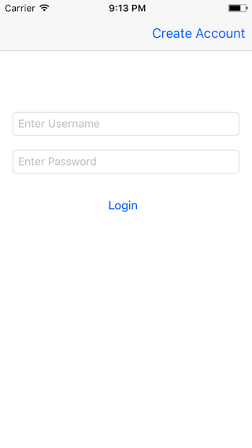

# NSUserDefaults-Segues-and-Protocols-Challenge - The Bitfountain iOS 7 Immersive
## iOS 7 Development Course

In this challenge we will practice creating a protocol, segues and NSUserDefaults for data persistence. Why are we practicing a protocol again? Getting the hang of protocols is difficult and is a major design pattern in iOS. It’s certainly worth practicing!

